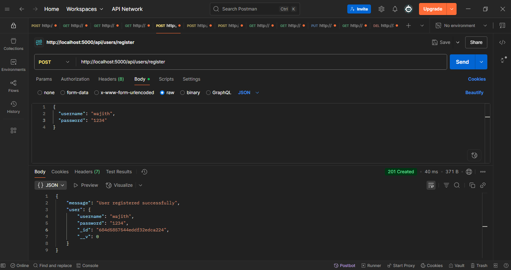
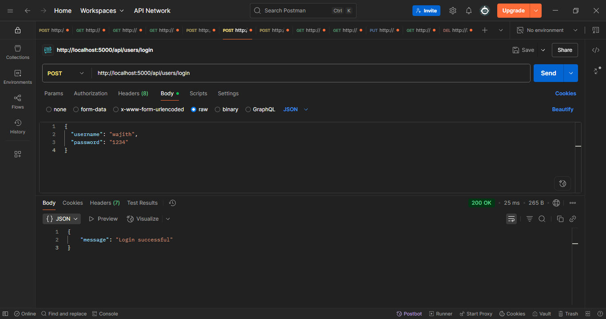
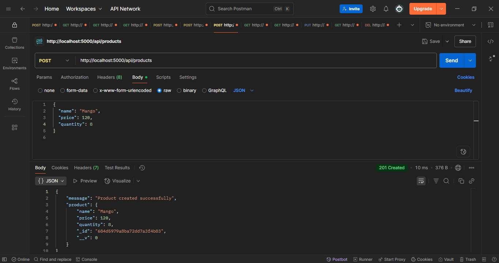
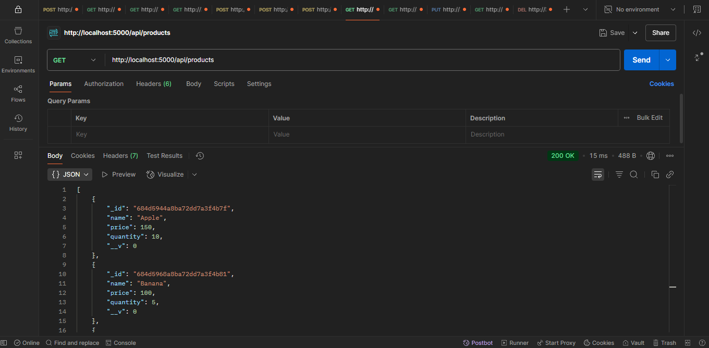
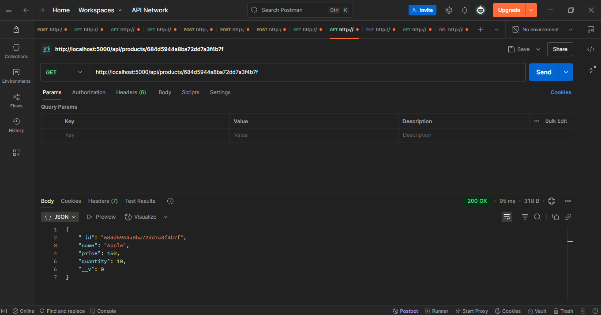
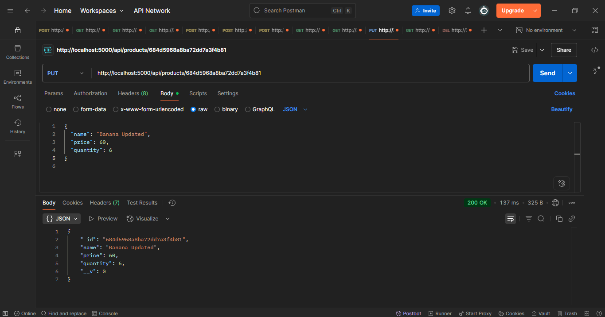
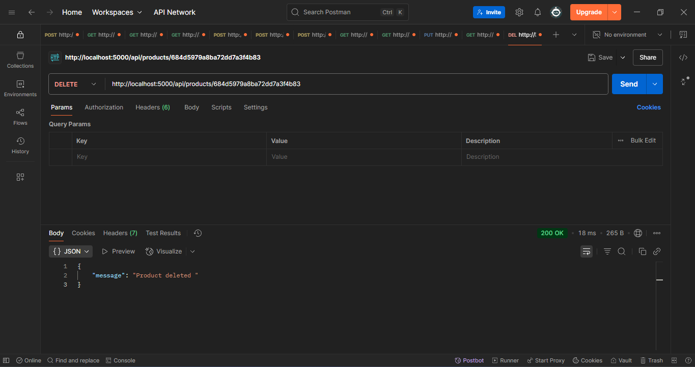

# 🚀 Backend Developer Assignment - Future Code Technology

This is a RESTful API built using **Node.js**, **Express**, and **MongoDB** as part of the backend developer assignment for Future Code Technology.

---

## 📌 Features

- 🧑 User Registration & Login (No Auth/Token needed)
- 🛒 CRUD operations for Products
- ✅ Tested with Postman
- 📦 MongoDB (via Mongoose)

---

## 🛠️ Technologies Used

- Node.js
- Express.js
- MongoDB
- Mongoose
- Postman (for testing)

---

## 📂 Project Structure

config/
controllers/
models/
postman/ # Postman screenshots here
routes/
.env
package.json
package-lock.json
server.js

---

## ⚙️ Setup Instructions

### Prerequisites

- Node.js (v14+ recommended)
- MongoDB (local or Atlas cluster)

### Steps

1. Clone the repository:

```bash
git clone https://github.com/M-Wajith/backend-developer-assignment.git
cd backend-developer-assignment


Install dependencies:

bash
Copy
Edit
npm install
Create a .env file in the root folder and add your MongoDB connection string and port:

ini
Copy
Edit
MONGO_URI=your_mongodb_connection_string
PORT=5000
Start the server:

bash
Copy
Edit
npm start
The server will start on the port specified in .env (default: 5000).

📡 API Endpoints
User Routes
Method	Endpoint	Description
POST	/api/users/register	Register a new user
POST	/api/users/login	User login

Product Routes
Method	Endpoint	Description
POST	/api/products	Create a new product
GET	/api/products	Get all products
GET	/api/products/:id	Get product by ID
PUT	/api/products/:id	Update a product
DELETE	/api/products/:id	Delete a product

🧪 Testing with Postman
You can test all endpoints using Postman. Below are screenshots showing the tested requests and responses:

### User Registration


### User Login


### Create Product


### Get All Products


### Get Product By ID


### Update Product


### Delete Product

```
